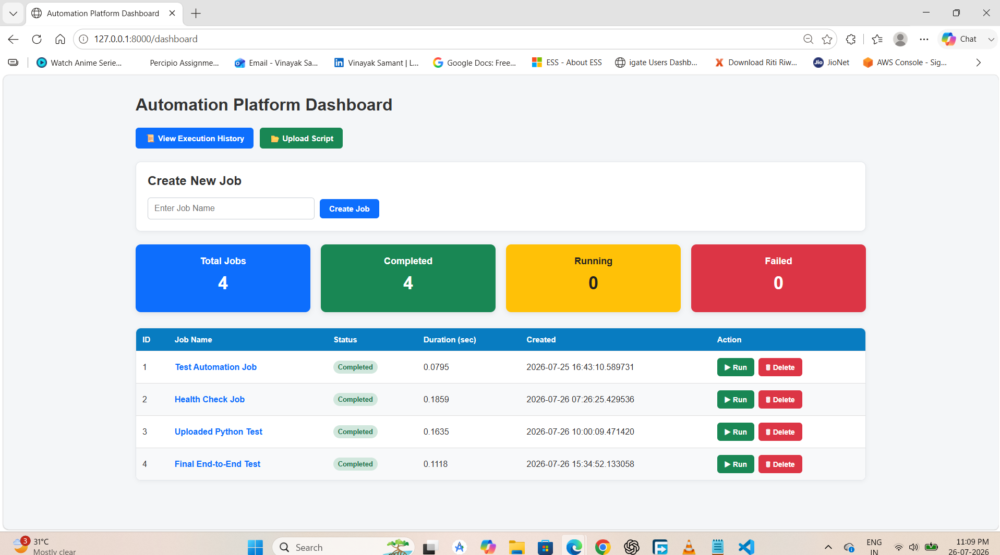
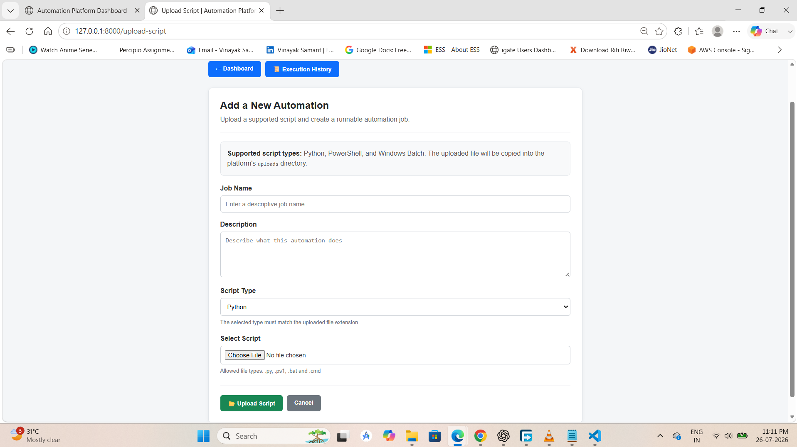
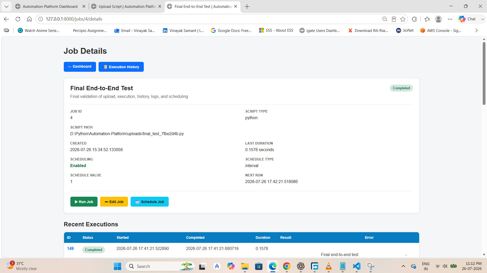
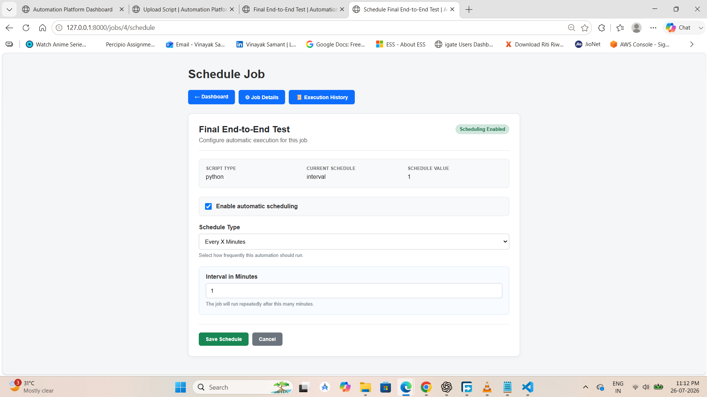
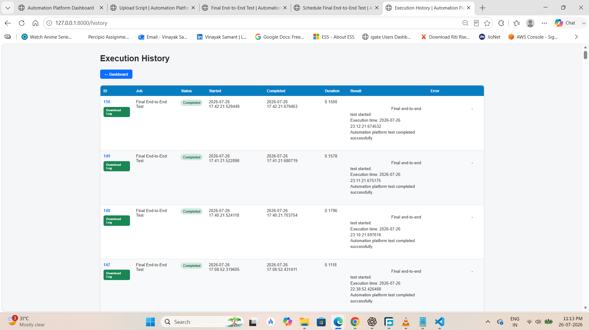
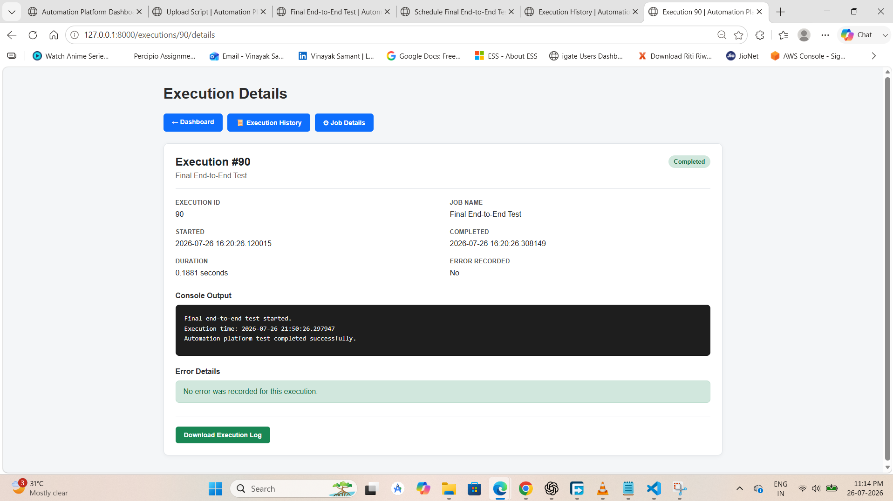

# Automation Platform

A web-based automation job management platform built with FastAPI, SQLAlchemy, SQLite, APScheduler, and Jinja2.

Automation Platform allows administrators to upload and manage automation scripts, execute jobs manually, configure recurring schedules, review execution history, inspect logs, and access a versioned REST API.

## Current Version

**Version 2.0.0**

The project maintains legacy API routes for backward compatibility and provides versioned endpoints under:

```text
/api/v1
```

## Key Features

### Job Management

- Create and manage automation jobs
- Upload Python, PowerShell, and Batch scripts
- Enable or disable jobs
- Duplicate and delete jobs
- Validate job names
- View job configuration and status

### Job Execution

- Run jobs manually
- Retry failed executions
- Track execution status
- Capture console output and errors
- Record start time, completion time, and duration
- Download individual execution logs

### Advanced Scheduler

- Every X minutes
- Hourly scheduling
- Daily scheduling
- Weekly scheduling
- Cron expression scheduling
- Pause and resume schedules
- Automatic next-run calculation

### Security

- JWT authentication
- Browser authentication using secure cookies
- Role-based access control
- Admin-only management actions
- Active and inactive user validation

### Audit and History

- Execution history
- Execution details
- Audit logging
- Job create, edit, delete, run, retry, upload, and scheduling events
- Execution History CSV export
- Audit Logs CSV export

### REST API

- Legacy endpoints retained for compatibility
- Versioned REST API under `/api/v1`
- Standard API response models
- Versioned Jobs API
- Versioned Authentication API
- Versioned Users API
- Global validation and exception handlers
- Swagger UI and ReDoc documentation

## Technology Stack

- Python
- FastAPI
- SQLAlchemy
- SQLite
- APScheduler
- Pydantic
- Jinja2
- HTML
- CSS
- JavaScript
- Uvicorn
- Pytest

## Project Structure

```text
Automation-Platform/
|-- app/
|   |-- api/
|   |   |-- auth.py
|   |   |-- auth_v1.py
|   |   |-- jobs.py
|   |   |-- jobs_v1.py
|   |   |-- pages.py
|   |   |-- users.py
|   |   `-- users_v1.py
|   |-- core/
|   |-- db/
|   |-- scheduler/
|   |-- schemas/
|   |-- services/
|   |-- static/
|   |-- templates/
|   |-- __init__.py
|   `-- main.py
|-- images/
|-- tests/
|-- uploads/
|-- create_admin.py
|-- create_db.py
|-- create_user.py
|-- migrate_add_job_columns.py
|-- migrate_add_schedule_paused.py
|-- requirements.txt
|-- validate_templates.py
|-- .gitignore
`-- README.md
```

## Installation

### 1. Clone the repository

```bash
git clone https://github.com/vsamant30/automation-platform.git
cd automation-platform
```

### 2. Create a virtual environment

#### Windows PowerShell

```powershell
python -m venv .venv
.\.venv\Scripts\Activate.ps1
```

#### Linux or macOS

```bash
python3 -m venv .venv
source .venv/bin/activate
```

### 3. Install dependencies

```bash
pip install -r requirements.txt
```

### 4. Initialize the database

```bash
python create_db.py
```

### 5. Create an administrator account

```bash
python create_admin.py
```

Follow the prompts displayed by the script.

## Running the Application

Start the FastAPI application:

```bash
uvicorn app.main:app --reload
```

Open the application in a browser:

```text
http://127.0.0.1:8000
```

Dashboard:

```text
http://127.0.0.1:8000/dashboard
```

Swagger API documentation:

```text
http://127.0.0.1:8000/docs
```

ReDoc documentation:

```text
http://127.0.0.1:8000/redoc
```

Health endpoint:

```text
http://127.0.0.1:8000/health
```

## API Overview

### Authentication API

```text
POST /api/v1/auth/login
GET  /api/v1/auth/me
```

### Jobs API

```text
GET  /api/v1/jobs/
POST /api/v1/jobs/
POST /api/v1/jobs/{job_id}/run
PUT  /api/v1/jobs/{job_id}/toggle
GET  /api/v1/jobs/check-name
```

### Users API

```text
GET  /api/v1/users/
POST /api/v1/users/
```

## Standard API Response

Successful versioned API responses use this structure:

```json
{
  "success": true,
  "message": "Operation completed successfully.",
  "data": {}
}
```

Validation and unexpected application errors use a standard error response structure.

## Authentication

Protected API endpoints require a JWT access token.

First obtain a token from:

```text
POST /api/v1/auth/login
```

Then include it in the request header:

```text
Authorization: Bearer <JWT_TOKEN>
```

## Screenshots

### Dashboard



### Upload Script



### Job Details



### Schedule Job



### Execution History



### Execution Details



## Development Workflow

Development is performed on version-specific branches.

Current development branch:

```text
develop-v2.0
```

Released version:

```text
v1.2.0
```

Before committing changes, run:

```powershell
python -m py_compile .\app\main.py
python -c "from app.main import app; print('application import successful')"
git diff --check
git status
```

## Testing

Run the automated test suite with:

```bash
pytest
```

## Important Publishing Notes

Do not commit:

- Virtual environments
- Local database files
- Uploaded automation scripts
- Log files
- Passwords, JWT secret keys, or other credentials
- Local environment configuration files

These files should be excluded through `.gitignore`.

## Roadmap

Potential future enhancements include:

- Docker deployment
- Environment-based configuration
- Database migrations using Alembic
- GitHub Actions CI
- Expanded automated tests
- Structured application logging
- Email and collaboration-platform notifications
- Remote execution agents
- External secrets-management integrations

## Author

**Vinayak Samant**